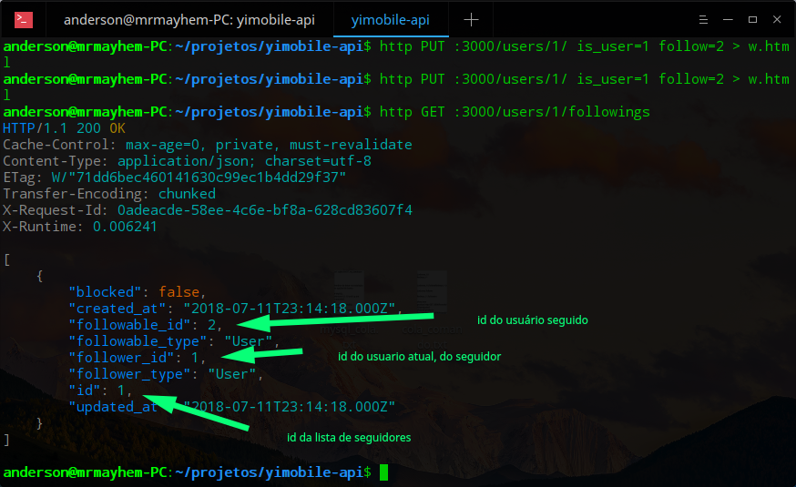
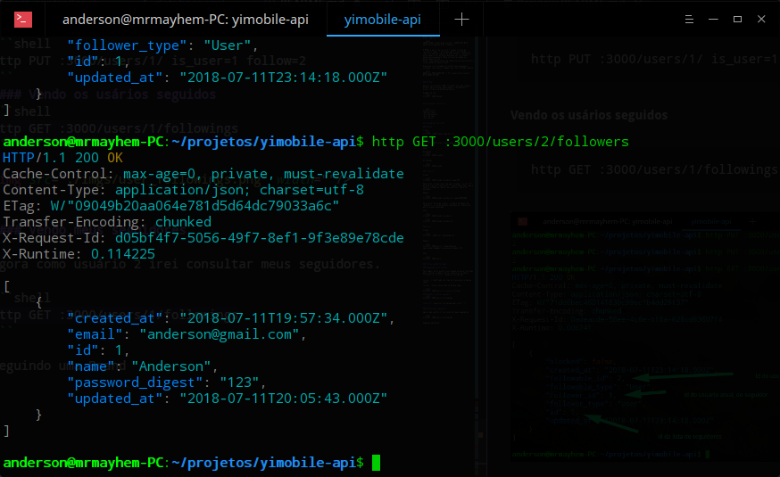
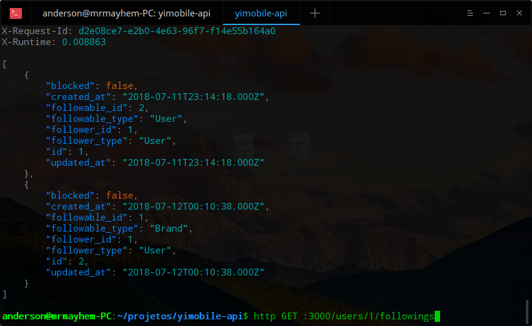
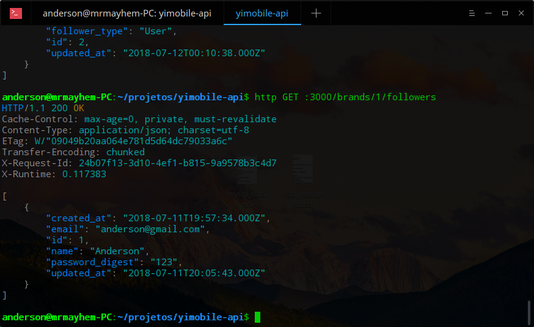

# README

Aplicação realizada para entrevista de estágio.

## Instalando/Configurando

### MYSQL

É necessário criar um usuário no banco com o username = yimobile e password = yimobile. Logado como root no MYSQL, digite:

```shell
CREATE USER 'yimobile'@'localhost' IDENTIFIED WITH mysql_native_password BY 'yimobile';
```

O MYSQL a partir da versão 5.7, mudou a forma de realizar o login, é utilizado agora o auth plugin. O rails não oferece suporte ao auth socket, é necessário então expecificar ao banco que deve ser utilizado o mysql_native_password. Mais informações podem ser encontradas no site https://www.digitalocean.com/community/tutorials/how-to-install-mysql-on-ubuntu-18-04.

E garanta os privilegios ao usuário para que posso interagir com o banco. Logado como root no MYSQL, digite:

```shell
GRANT ALL PRIVILEGES ON *.* TO 'yimobile'@'localhost' WITH GRANT OPTION;
```


### HTTPie

Para as solicitações JSON, interagi com a api usando o HTTPie. Para instalar basta seguir a documentação https://httpie.org/doc#installation.

Exemplo de uso:
```shell
http GET :3000/brands/
```


## Executando a Aplicação 


```shell
bundle install
rake db:create
rails db:migrate
rails db:seed
rails server
```

## Interagindo com a API

### Brands

Create
```shell
http POST :3000/brands name=Ferrari
```

Update
```shell
http PUT :3000/brands/1 name=Lamborguini
```

Show

One Brand
```shell
http GET :3000/brands/1
```

All Brands

```shell
http GET :3000/brands/
```

### Products

Create

```shell
http GET :3000/brands/1/products name=F50
```
Observação: O numero que vem apos /brands/ é o id **1**, pertece a marca **Lamborguini** registrada acima, sempre tenha o cuidado de lembrar de substituir com o id desejado.

Update 

```shell
http PUT :3000/brands/1/products/1 name=AVENTADOR
```

Observação: De forma similar, o numero de depois de /products/ é o id do produto, que deve ser subistuído pelo o produto desejado.

Show

```shell
http GET :3000/brands/1/products
```
```shell
http GET :3000/brands/1/products/1
```

### Users

Create

```shell
http POST :3000/users name=Anderson
```

Update

```shell
http PUT :3000/users/1/ name=Anderson email=anderson@gmail.com password_digest=123
```

Show

```shell
http GET :3000/users
```

### Follow and Be Followed

#### Seguindo outro usuário

Para seguir outro usuário use o mesmo processo utilizado para realizar o update. Porem, somente as variáveis **follow** e **is_user** devem ser atribuídas. is_user -> identicador do tipo de classe que se deseja seguir. follow -> id da classes que se deseja seguir. 

```shell
http PUT :3000/users/1/ is_user=1 follow=2 
```
#### Vendo os usários seguidos
```shell
http GET :3000/users/1/followings 
```

 


#### Vendo meus seguidores

Agora como usuário 2 irei consultar meus seguidores.

```shell
http GET :3000/users/2/followers 
```



Obs: Como se trata de seguidores, é possível conhecer todos os seus atributos, diferente do caso acima, que só é possível conhecer o id.

#### Seguindo uma Brand

Para seguir uma brand é bastante similar ao caso de seguir um usário, para seguir uma brand basta atribuir o valor is_user = 0.

```shell
http PUT :3000/users/1/ is_user=0 follow=1 
```
Ao consultar a minha lista de seguidas.

```shell
http GET :3000/users/1/followings 
```


#### Uma Brand consultando seus seguidores





